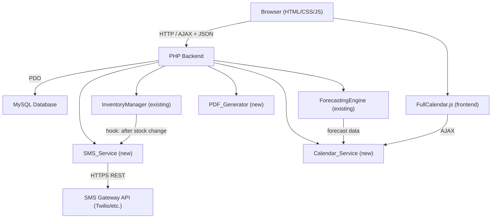

# Design Document: Blue Eco Farm Integrations

## Overview

This document describes the technical design for three integrations added to the existing Blue Eco Farm PHP inventory system:

1. **SMS Integration** — Threshold-based SMS alerts via a third-party gateway (Twilio or equivalent) triggered after stock-out and transfer operations.
2. **PDF Report Integration** — On-demand PDF generation of stock movement reports using the TCPDF or FPDF library.
3. **Calendar Service Integration** — A JavaScript calendar UI (FullCalendar.js) that visualises per-product sales forecasts produced by the existing `ForecastingEngine`.

All three integrations are additive — they do not modify existing database tables or core classes. They introduce new PHP service classes, new API endpoints, new database tables, and new frontend pages.

---

## Architecture



**New components:**
- `src/SmsService.php` — composes and dispatches SMS via gateway; reads Alert_Rules; writes to `sms_alert_log`
- `src/PdfGenerator.php` — queries stock_records, formats and renders PDF via TCPDF
- `src/CalendarService.php` — wraps ForecastingEngine output into calendar-friendly JSON
- `api/alerts.php` — CRUD for Alert_Rules
- `api/sms_log.php` — read-only SMS alert log
- `api/reports.php` — triggers PDF generation and streams the file
- `api/calendar.php` — returns Forecast_Events as JSON for FullCalendar
- `alerts.php` — frontend page for managing Alert_Rules
- `sms_log.php` — frontend page for viewing SMS alert history
- `reports.php` — frontend page for requesting PDF reports
- `calendar.php` — frontend page with FullCalendar integration

---

## Components and Interfaces

### SmsService

```php
class SmsService {
    // Evaluate all Alert_Rules for a product+warehouse after a stock change
    public function checkAndAlert(int $productId, int $warehouseId, int $currentStock): void;

    // Send a single SMS; returns true on success, false on gateway error
    public function send(string $to, string $message): bool;

    // Compose the alert message body
    public function composeMessage(string $productName, string $warehouseName,
                                   int $currentStock, int $threshold): string;
}
```

`checkAndAlert()` is called by `InventoryManager::addOutgoing()` and `TransferManager::transfer()` after each successful write. It:
1. Queries `alert_rules` for matching product + warehouse where `threshold >= currentStock`
2. Checks `sms_alert_log` for a recent dispatch within the cooldown window
3. Calls `send()` for each recipient; logs result to `sms_alert_log`

### PdfGenerator

```php
class PdfGenerator {
    // Build and return raw PDF bytes for a stock movement report
    public function generateStockMovementReport(
        string $dateFrom,
        string $dateTo,
        ?int $warehouseId = null,
        ?int $productId = null
    ): string;
}
```

Uses TCPDF to render:
- Header: Blue Eco Farm name + logo, report title, generation timestamp, applied filters
- Body: transaction table (date, product, warehouse, type, quantity, notes)
- Summary: total incoming / outgoing per product
- Footer: page numbers; table header repeated on each page

### CalendarService

```php
class CalendarService {
    // Return FullCalendar-compatible event array for a given month
    public function getForecastEvents(int $year, int $month, ?int $productId = null): array;
}
```

Calls `ForecastingEngine::predict()` for each product (or the selected product), maps predicted quantities to dates within the requested month, and returns an array of FullCalendar event objects:

```json
[
  {
    "id": "forecast-1-2025-08-15",
    "title": "Big Pack Granules: 42",
    "start": "2025-08-15",
    "extendedProps": {
      "productId": 1,
      "predictedQty": 42,
      "dataPoints": 12
    }
  }
]
```

### API Endpoints

| Endpoint | Method | Description |
|---|---|---|
| `api/alerts.php?action=list` | GET | List all Alert_Rules |
| `api/alerts.php?action=create` | POST | Create an Alert_Rule |
| `api/alerts.php?action=update` | POST | Update an Alert_Rule |
| `api/alerts.php?action=delete` | POST | Delete an Alert_Rule |
| `api/sms_log.php?action=list` | GET | List SMS alert log entries (paginated, desc) |
| `api/reports.php?action=generate` | GET | Generate and stream PDF report |
| `api/calendar.php?action=events` | GET | Return Forecast_Events JSON for FullCalendar |

---

## Data Models

### New Database Tables

```sql
-- Alert rules: one row per threshold configuration
CREATE TABLE alert_rules (
    id              INT AUTO_INCREMENT PRIMARY KEY,
    product_id      INT NOT NULL,
    warehouse_id    TINYINT NOT NULL,
    threshold       INT NOT NULL,           -- alert when stock <= threshold
    recipients      TEXT NOT NULL,          -- JSON array of E.164 phone numbers
    cooldown_minutes INT NOT NULL DEFAULT 60,
    is_active       TINYINT(1) DEFAULT 1,
    created_at      DATETIME DEFAULT CURRENT_TIMESTAMP,
    updated_at      DATETIME DEFAULT CURRENT_TIMESTAMP ON UPDATE CURRENT_TIMESTAMP,
    FOREIGN KEY (product_id) REFERENCES products(id)
);

-- Log of every SMS dispatch attempt
CREATE TABLE sms_alert_log (
    id              INT AUTO_INCREMENT PRIMARY KEY,
    alert_rule_id   INT NOT NULL,
    recipient       VARCHAR(20) NOT NULL,   -- E.164 phone number
    message         TEXT NOT NULL,
    status          ENUM('success','failure') NOT NULL,
    error_detail    TEXT,
    dispatched_at   DATETIME DEFAULT CURRENT_TIMESTAMP,
    FOREIGN KEY (alert_rule_id) REFERENCES alert_rules(id)
);
```

No changes to existing tables.

### PHP Class Structure (new files)

```
src/
  SmsService.php        -- Alert rule evaluation, SMS dispatch, log writes
  PdfGenerator.php      -- PDF composition via TCPDF
  CalendarService.php   -- Forecast-to-calendar mapping
api/
  alerts.php            -- Alert_Rule CRUD endpoint
  sms_log.php           -- SMS log read endpoint
  reports.php           -- PDF generation + streaming endpoint
  calendar.php          -- Forecast events JSON endpoint
alerts.php              -- Frontend: manage alert rules
sms_log.php             -- Frontend: view SMS history
reports.php             -- Frontend: request PDF reports
calendar.php            -- Frontend: FullCalendar view
```

### SMS Gateway Configuration

Gateway credentials (API key, sender number) are stored in `config/integrations.php` (not committed to version control):

```php
return [
    'sms' => [
        'provider'   => 'twilio',          // or 'vonage', 'semaphore', etc.
        'account_sid'=> 'ACxxxxxxxx',
        'auth_token' => 'xxxxxxxx',
        'from_number'=> '+1234567890',
    ],
];
```

`SmsService` reads this config and uses PHP's `curl` to call the gateway REST API directly (no SDK dependency required).

---

## Correctness Properties

*A property is a characteristic or behavior that should hold true across all valid executions of a system — essentially, a formal statement about what the system should do. Properties serve as the bridge between human-readable specifications and machine-verifiable correctness guarantees.*


### Property 1: Alert_Rule validation rejects invalid inputs

*For any* Alert_Rule submission missing a required field (product, warehouse, threshold, or recipient) or containing a phone number not in E.164 format, the System SHALL reject the entry and return an error response — it SHALL NOT persist the rule.

**Validates: Requirements 1.2, 1.3**

---

### Property 2: Multiple Alert_Rules per product-warehouse pair

*For any* product and warehouse, creating N distinct Alert_Rules for that pair SHALL result in all N rules being independently stored and retrievable.

**Validates: Requirements 1.4**

---

### Property 3: Deleted Alert_Rule is not evaluated

*For any* Alert_Rule that has been deleted, a subsequent stock operation that would have breached that rule's threshold SHALL NOT produce a new entry in `sms_alert_log` for that rule.

**Validates: Requirements 1.5**

---

### Property 4: SMS alert fires for all recipients when threshold is breached

*For any* Alert_Rule with N recipients, when a stock operation causes the current stock to fall at or below the rule's threshold, the System SHALL create N entries in `sms_alert_log` — one per recipient — for that dispatch event.

**Validates: Requirements 2.1**

---

### Property 5: Alert message contains required fields

*For any* combination of product name, warehouse name, current stock quantity, and threshold value, the message produced by `SmsService::composeMessage()` SHALL contain all four values as substrings.

**Validates: Requirements 2.2**

---

### Property 6: SMS dispatch log completeness (success and failure)

*For any* SMS dispatch attempt — whether the gateway returns success or failure — a corresponding entry SHALL exist in `sms_alert_log` with the correct `alert_rule_id`, `recipient`, `status`, and `dispatched_at`. When the gateway fails for one recipient, the remaining recipients SHALL still receive dispatch attempts.

**Validates: Requirements 2.3, 2.5, 3.1**

---

### Property 7: Cooldown deduplication

*For any* Alert_Rule, if an SMS alert was dispatched for that rule within the last `cooldown_minutes` minutes, a subsequent stock event that again breaches the threshold SHALL NOT produce a new `sms_alert_log` entry for that rule.

**Validates: Requirements 2.4**

---

### Property 8: SMS log entries sorted descending by timestamp

*For any* set of `sms_alert_log` entries, the list endpoint SHALL return them ordered by `dispatched_at` descending (most recent first).

**Validates: Requirements 3.2**

---

### Property 9: Report data completeness and filter correctness

*For any* valid date range and optional warehouse/product filters, the data set assembled by `PdfGenerator` SHALL contain exactly the stock transactions that fall within the date range AND match all applied filters — no more, no fewer.

**Validates: Requirements 4.1, 4.2**

---

### Property 10: Report data structure completeness

*For any* generated report, the data structure passed to the PDF renderer SHALL include: report title, generation timestamp, applied filters, a non-null transaction list, and a summary map of total incoming and outgoing quantities per product.

**Validates: Requirements 4.3**

---

### Property 11: Invalid date range is rejected

*For any* report request where the start date is strictly after the end date, the System SHALL return a validation error and SHALL NOT produce a PDF.

**Validates: Requirements 4.6**

---

### Property 12: Thousand-separator formatting

*For any* integer quantity Q, the formatting function SHALL produce a string where digits are grouped in threes from the right, separated by commas (e.g., 1250 → "1,250", 1000000 → "1,000,000").

**Validates: Requirements 5.4**

---

### Property 13: Calendar events scoped to requested month

*For any* year/month request to `CalendarService::getForecastEvents()`, all returned Forecast_Events SHALL have a `start` date within that year and month, and no events from other months SHALL be included.

**Validates: Requirements 6.1, 7.1**

---

### Property 14: Forecast event date mapping correctness

*For any* forecast output from `ForecastingEngine`, the Forecast_Events produced by `CalendarService` SHALL have `start` dates that correspond to the predicted future periods, and the `extendedProps.predictedQty` SHALL equal the forecasted quantity for that period.

**Validates: Requirements 6.2**

---

### Property 15: Product filter on calendar events

*For any* product filter applied to `CalendarService::getForecastEvents()`, all returned events SHALL have `extendedProps.productId` equal to the requested product ID — no events for other products SHALL be included.

**Validates: Requirements 6.3**

---

### Property 16: Forecast event payload completeness

*For any* Forecast_Event returned by `CalendarService`, the event object SHALL contain `extendedProps.productId`, `extendedProps.predictedQty`, and `extendedProps.dataPoints` as non-null values.

**Validates: Requirements 6.4**

---

### Property 17: Insufficient data produces indicator event

*For any* product with fewer than 5 historical outgoing stock records, `CalendarService::getForecastEvents()` SHALL return an indicator event object for that product (with a flag such as `extendedProps.insufficientData = true`) rather than a numeric forecast event.

**Validates: Requirements 6.5**

---

### Property 18: Multi-product same-date completeness

*For any* month where K products each have a Forecast_Event on the same calendar date, the events array SHALL contain at least K entries for that date — one per product.

**Validates: Requirements 7.3**

---

## Error Handling

| Scenario | HTTP Status | Response |
|---|---|---|
| Missing required field in Alert_Rule | 400 | `{"error": "Field <name> is required"}` |
| Invalid phone number format | 400 | `{"error": "Invalid phone number format for <number>; expected E.164"}` |
| Alert_Rule not found | 404 | `{"error": "Alert rule {id} not found"}` |
| SMS gateway error | Logged only | Failure recorded in `sms_alert_log`; no HTTP error to end user |
| Report date range invalid (start > end) | 400 | `{"error": "date_from must not be after date_to"}` |
| No transactions in date range | 200 | PDF produced with "no transactions found" message |
| Forecast insufficient data (calendar) | 200 | Indicator event returned instead of forecast event |
| Database error | 500 | `{"error": "Internal server error"}` (details logged server-side) |

---

## Testing Strategy

### Dual Testing Approach

Both unit tests and property-based tests are required and complementary:

- **Unit tests** cover specific examples, edge cases, and error conditions (e.g., empty date range, gateway failure mock, E.164 validation edge cases)
- **Property-based tests** verify universal correctness properties across randomly generated inputs

### Unit Testing

- Framework: **PHPUnit**
- Use a test MySQL schema (or SQLite via PDO) for isolation
- Mock the SMS gateway HTTP call using a stub/mock class injected into `SmsService`
- Cover: Alert_Rule CRUD validation, `composeMessage()` output, cooldown logic, PDF data assembly, `CalendarService` mapping, filter correctness

### Property-Based Testing

- Library: **eris** (PHP property-based testing) or a custom generator loop with PHPUnit
- Minimum **100 iterations** per property test
- Tag format: `// Feature: blue-eco-farm-integrations, Property N: <property_text>`

| Property | Test Description |
|---|---|
| Property 1 | Generate random Alert_Rule inputs (valid and invalid); assert invalid ones are rejected |
| Property 2 | Generate N rules for same product+warehouse; assert all N are stored |
| Property 3 | Create rule, delete it, trigger stock breach; assert no new log entry |
| Property 4 | Generate rules with N recipients, trigger breach; assert N log entries created |
| Property 5 | Generate random product/warehouse/stock/threshold combos; assert all appear in message |
| Property 6 | Mock gateway success/failure randomly; assert every attempt has a log entry |
| Property 7 | Trigger two breaches within cooldown window; assert only one log entry |
| Property 8 | Insert log entries with random timestamps; assert API returns them desc |
| Property 9 | Generate random transactions and date/filter combos; assert query returns correct subset |
| Property 10 | Generate random report requests; assert data structure has all required keys |
| Property 11 | Generate (start, end) pairs where start > end; assert all are rejected |
| Property 12 | Generate random integers; assert formatted string has correct comma grouping |
| Property 13 | Request events for random year/month; assert all event dates are within that month |
| Property 14 | Generate forecast outputs; assert event dates and quantities match forecast data |
| Property 15 | Request events with product filter; assert all events have matching productId |
| Property 16 | Generate forecast events; assert all have required extendedProps fields |
| Property 17 | Generate products with 0–4 data points; assert indicator event returned |
| Property 18 | Generate months where multiple products share a date; assert all appear |
