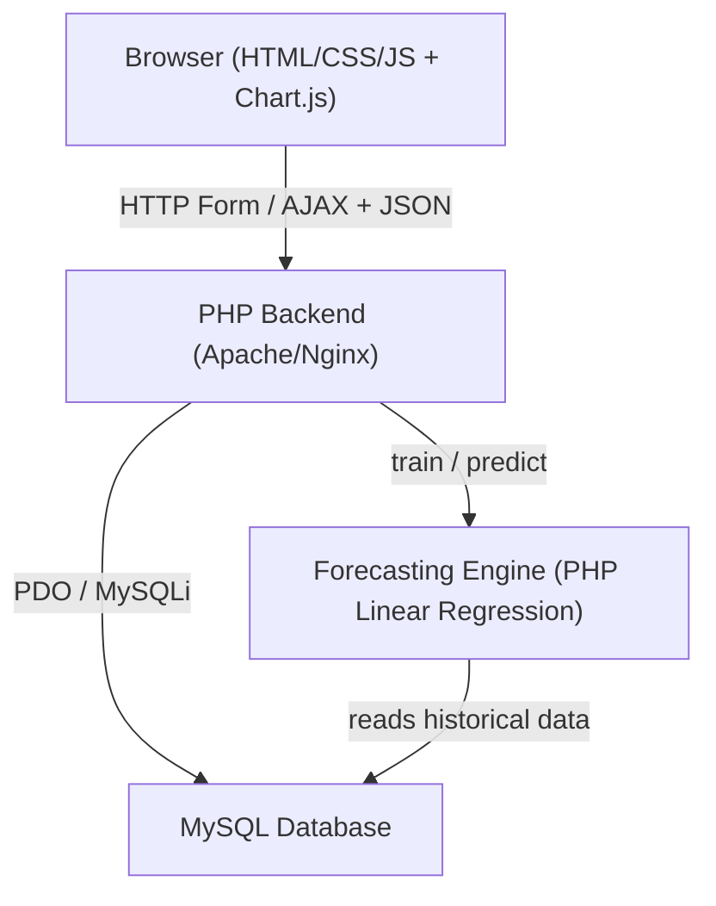

# Design Document: Blue Eco Farm Inventory and Sales Forecasting System

## Overview

The system is a PHP web application with an HTML/CSS/JavaScript frontend, a MySQL relational database, Chart.js for data visualization, and a PHP-based Linear Regression forecasting engine. Staff interact through a browser-based dashboard to manage inventory across two warehouses (Farm and Paranaque), record stock transactions, transfer stock, and view ML-generated sales forecasts.

---

## Architecture



**Layers:**
- **Frontend**: HTML/CSS pages with vanilla JavaScript and Chart.js for graphs; AJAX calls to PHP endpoints
- **Backend**: PHP scripts handling routing, business logic, validation, and ML orchestration
- **Database**: MySQL with PDO; stores products, stock records, transfers, and transaction logs
- **Forecasting Engine**: PHP implementation of Linear Regression (using php-ml library or a lightweight custom implementation); trained per-product on historical outgoing stock data

---

## Components and Interfaces

### Frontend Pages and Components

| Page / Component | Responsibility |
|---|---|
| `index.php` (Dashboard) | Displays current stock totals per product per warehouse, stock-in/out graphs, forecast graph |
| `stock_in.php` | Form for adding incoming stock entries |
| `stock_out.php` | Form for recording outgoing stock entries |
| `update_record.php` | Form for correcting an existing stock record |
| `transfer.php` | Form for initiating a Farm → Paranaque stock transfer |
| `forecast.php` | Page displaying Linear Regression forecast per product |
| `transaction_log.php` | Table view of all create/update/delete operations |
| `chart_data.php` | AJAX endpoint returning JSON data for Chart.js graphs |

### Backend PHP Endpoints / Actions

| File / Action | Method | Description |
|---|---|---|
| `api/stock.php?action=add_incoming` | POST | Add incoming stock record |
| `api/stock.php?action=add_outgoing` | POST | Record outgoing stock |
| `api/stock.php?action=update` | POST | Update an existing stock record |
| `api/stock.php?action=delete` | POST | Soft-delete a stock record |
| `api/stock.php?action=get_totals` | GET | Get current stock totals (optionally by warehouse) |
| `api/transfer.php?action=create` | POST | Initiate a Farm → Paranaque transfer |
| `api/transfer.php?action=list` | GET | List all transfer records |
| `api/forecast.php?action=predict` | GET | Get Linear Regression forecast for a product |
| `api/chart_data.php` | GET | Return time-series JSON for Chart.js |

---

## Data Models

### MySQL Schema

```sql
-- Static product catalog (seeded once)
CREATE TABLE products (
    id        INT AUTO_INCREMENT PRIMARY KEY,
    name      VARCHAR(50) NOT NULL UNIQUE,  -- e.g. 'Big Pack Granules'
    pack_size ENUM('big','small') NOT NULL,
    form      ENUM('granules','tablet','powder') NOT NULL
);

-- Every stock transaction (incoming or outgoing)
CREATE TABLE stock_records (
    id               INT AUTO_INCREMENT PRIMARY KEY,
    product_id       INT NOT NULL,
    warehouse_id     TINYINT NOT NULL,       -- 1 = Farm, 2 = Paranaque
    record_type      ENUM('incoming','outgoing') NOT NULL,
    quantity         INT NOT NULL,           -- always > 0
    transaction_date DATE NOT NULL,
    notes            TEXT,
    is_deleted       TINYINT(1) DEFAULT 0,   -- soft-delete flag
    created_at       DATETIME DEFAULT CURRENT_TIMESTAMP,
    updated_at       DATETIME DEFAULT CURRENT_TIMESTAMP ON UPDATE CURRENT_TIMESTAMP,
    FOREIGN KEY (product_id) REFERENCES products(id)
);

-- Stock transfers Farm → Paranaque
CREATE TABLE transfers (
    id                       INT AUTO_INCREMENT PRIMARY KEY,
    product_id               INT NOT NULL,
    quantity                 INT NOT NULL,
    transfer_date            DATE NOT NULL,
    source_warehouse_id      TINYINT NOT NULL DEFAULT 1,
    destination_warehouse_id TINYINT NOT NULL DEFAULT 2,
    created_at               DATETIME DEFAULT CURRENT_TIMESTAMP,
    FOREIGN KEY (product_id) REFERENCES products(id)
);

-- Audit log for all CRUD operations on stock_records
CREATE TABLE transaction_logs (
    id          INT AUTO_INCREMENT PRIMARY KEY,
    operation   ENUM('create','update','delete') NOT NULL,
    table_name  VARCHAR(50) NOT NULL,
    record_id   INT NOT NULL,
    snapshot    JSON,                        -- before/after values
    changed_at  DATETIME DEFAULT CURRENT_TIMESTAMP
);
```

### Derived: Current Stock Total

Current stock is computed via aggregation (not a stored counter) to stay consistent with the transaction log:

```sql
SELECT
    SUM(CASE WHEN sr.record_type = 'incoming' THEN sr.quantity ELSE 0 END)
  - SUM(CASE WHEN sr.record_type = 'outgoing' THEN sr.quantity ELSE 0 END)
  + COALESCE((SELECT SUM(quantity) FROM transfers
              WHERE product_id = ? AND destination_warehouse_id = ?), 0)
  - COALESCE((SELECT SUM(quantity) FROM transfers
              WHERE product_id = ? AND source_warehouse_id = ?), 0)
  AS current_stock
FROM stock_records sr
WHERE sr.product_id = ? AND sr.warehouse_id = ? AND sr.is_deleted = 0;
```

### PHP Class Structure

```
src/
  Database.php          -- PDO singleton connection
  InventoryManager.php  -- CRUD operations, validation, stock total computation
  TransferManager.php   -- Transfer logic (atomic transaction)
  ForecastingEngine.php -- Linear Regression training and prediction
  TransactionLogger.php -- Writes to transaction_logs table
```

---

## Correctness Properties

*A property is a characteristic or behavior that should hold true across all valid executions of a system — essentially, a formal statement about what the system should do. Properties serve as the bridge between human-readable specifications and machine-verifiable correctness guarantees.*

### Property 1: Stock total non-negativity invariant

*For any* product and warehouse, the computed current stock total SHALL never be negative after any sequence of valid incoming, outgoing, or transfer operations.

**Validates: Requirements 4.2, 5.2, 6.2**

---

### Property 2: Transfer atomicity — total conservation

*For any* valid transfer of quantity Q for product P from the Farm Warehouse to the Paranaque Warehouse, the sum `stock(P, Farm) + stock(P, Paranaque)` SHALL remain unchanged before and after the transfer.

**Validates: Requirements 6.1**

---

### Property 3: Incoming stock addition correctness

*For any* incoming stock entry with quantity Q for product P at warehouse W, after the entry is committed, querying the current stock for P at W SHALL return a value exactly Q greater than the stock before the entry.

**Validates: Requirements 3.1**

---

### Property 4: Outgoing stock deduction correctness

*For any* outgoing stock entry with quantity Q for product P at warehouse W (where Q ≤ current stock), after the entry is committed, querying the current stock for P at W SHALL return a value exactly Q less than the stock before the entry.

**Validates: Requirements 4.1**

---

### Property 5: Update recalculation consistency

*For any* stock record update that changes quantity from Q_old to Q_new, the resulting current stock total SHALL differ from the pre-update total by exactly (Q_new − Q_old).

**Validates: Requirements 5.1**

---

### Property 6: Forecast minimum data guard

*For any* product type with fewer than 5 historical outgoing stock records, the Forecasting_Engine SHALL return an error response and SHALL NOT return a numeric forecast value.

**Validates: Requirements 8.2, 8.3**

---

### Property 7: Soft-delete exclusion from totals

*For any* stock record marked as deleted (is_deleted = 1), the record SHALL NOT contribute to the computed current stock total for any product at any warehouse.

**Validates: Requirements 4.1, 5.1**

---

### Property 8: Transaction log completeness

*For any* create, update, or delete operation on a stock record, a corresponding transaction_logs entry SHALL exist with the correct operation type, table name, and record identifier.

**Validates: Requirements 9.3**

---

## Error Handling

| Scenario | Response |
|---|---|
| Missing required field | HTTP 400 — JSON `{"error": "Field <name> is required"}` |
| Quantity ≤ 0 | HTTP 400 — JSON `{"error": "Quantity must be greater than zero"}` |
| Outgoing/transfer exceeds stock | HTTP 409 — JSON `{"error": "Insufficient stock: available X, requested Y"}` |
| Record not found | HTTP 404 — JSON `{"error": "Stock record {id} not found"}` |
| Invalid product type | HTTP 400 — JSON `{"error": "Invalid product type"}` |
| Fewer than 5 data points for forecast | HTTP 422 — JSON `{"error": "Insufficient data: need 5 records, have N"}` |
| Database error | HTTP 500 — JSON `{"error": "Internal server error"}` (details logged server-side) |

All API responses use `Content-Type: application/json`. HTML pages display inline error messages.

---

## Testing Strategy

### Dual Testing Approach

Both unit tests and property-based tests are required and complementary:

- **Unit tests** cover specific examples, edge cases, and error conditions
- **Property-based tests** verify universal correctness properties across randomly generated inputs

### Unit Testing

- Framework: **PHPUnit**
- Cover: InventoryManager CRUD logic, TransferManager atomicity, ForecastingEngine error on < 5 points, validation edge cases
- Use an in-memory SQLite database (via PDO) or a dedicated test MySQL schema for isolation

### Property-Based Testing

- Library: **eris** (PHP property-based testing library) or a custom generator loop with PHPUnit
- Minimum **100 iterations** per property test
- Each test is tagged with a comment referencing the design property:
  - Tag format: `// Feature: blue-eco-farm-inventory, Property N: <property_text>`

| Property | Test Description |
|---|---|
| Property 1 | Generate random sequences of valid incoming/outgoing/transfer ops; assert stock ≥ 0 always |
| Property 2 | Generate random valid transfers; assert Farm+Paranaque total is unchanged |
| Property 3 | Generate random incoming entries; assert stock increases by exact quantity |
| Property 4 | Generate random valid outgoing entries; assert stock decreases by exact quantity |
| Property 5 | Generate random record updates; assert total shifts by (Q_new − Q_old) |
| Property 6 | Generate products with 0–4 data points; assert forecast always returns error |
| Property 7 | Generate records, soft-delete some, assert deleted records excluded from totals |
| Property 8 | Generate any CRUD operation; assert log entry exists with correct metadata |
